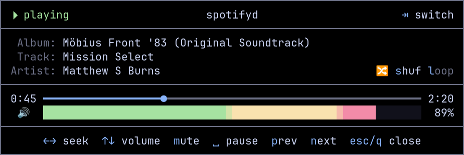

# tmux-player-ctl

A minimal tmux popup controller for MPRIS media players via `playerctl`.



## Requirements

- `tmux` (3.2+ for popup support)
- `playerctl`
- `python3`

## Installation

1. Clone or download the script:
   ```bash
   git clone https://github.com/YOUR_USERNAME/tmux-player-ctl.git
   cd tmux-player-ctl
   ```

2. Make it executable:
   ```bash
   chmod +x tmux-player-ctl.py
   ```

3. Move it somewhere in your PATH (optional):
   ```bash
   cp tmux-player-ctl.py ~/bin/tmux-player-ctl
   ```

## Usage

Run the script in a tmux popup:
```bash
# Tight fit (recommended - matches UI exactly)
tmux display-popup -B -xC -yC -w72 -h12 -E "tmux-player-ctl.py"

# Full terminal
tmux display-popup -x0 -y0 -w100% -h100% -k -E "tmux-player-ctl.py"
```

Or with the full path:
```bash
tmux display-popup -B -xC -yC -w72 -h12 -E "python3 /path/to/tmux-player-ctl.py"
```

## Keybindings

Add to your `~/.tmux.conf`:

```bash
# Bind to a key (e.g., M-p for Alt-p)
bind-key M-p display-popup -x0 -y0 -w100% -h100% -k -E "tmux-player-ctl"

# Or bind to a chord
bind-key -n M-C-m display-popup -x0 -y0 -w100% -h100% -k -E "tmux-player-ctl"
```

Then reload tmux config:
```bash
tmux source ~/.tmux.conf
```

## Controls

| Key | Action |
|-----|--------|
| `Space` or `p` | Toggle play/pause |
| `n` | Next track |
| `b` | Previous track |
| `←` / `→` | Seek back/forward 10s |
| `↑` / `↓` | Volume up/down 5% |
| `s` | Toggle shuffle |
| `l` | Cycle loop (none → track → playlist) |
| `m` | Mute/unmute |
| `Tab` | Switch between players |
| `q` or `Esc` | Exit |

## Theming

Override colors via environment variables:

```bash
export TPCTL_ACCENT="\033[92m"       # green (playing)
export TPCTL_ACCENT_ALT="\033[93m"  # yellow (paused)
export TPCTL_DIM="\033[90m"
export TPCTL_BAR_EMPTY="\033[90m"
export TPCTL_BAR_FILL="\033[97m"
export TPCTL_BORDER="\033[37m"
```

### Catppuccin Mocha

```bash
export TPCTL_ACCENT="\033[38;2;166;227;161m"    # green
export TPCTL_ACCENT_ALT="\033[38;2;249;226;175m"  # yellow
export TPCTL_DIM="\033[38;2;108;112;134m"
export TPCTL_BAR_EMPTY="\033[38;2;49;50;68m"
export TPCTL_BAR_FILL="\033[38;2;137;180;250m"   # blue
export TPCTL_BORDER="\033[38;2;88;91;112m"
```

## License

MIT
